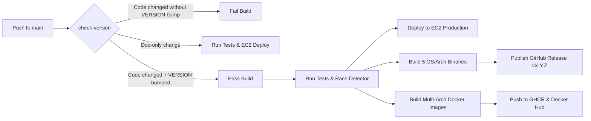

# Contributing to CEE

Thank you for your interest in contributing to **CEE (Code Execution Engine)**! We welcome contributions of all kinds: bug fixes, new features, language runners, security enhancements, and documentation improvements.

[](CONTRIBUTE.md)
[](https://github.com/navneetguptacse/cee.io/actions/workflows/ci.yml)
[](VERSION)
[](https://golang.org)
[](https://golang.org/cmd/gofmt/)
[](LICENSE)

This guide outlines our development workflow, coding standards, versioning rules, and submission process to ensure seamless collaboration.

---

## Table of Contents

1. [Development Setup](#development-setup)
2. [Project Architecture](#project-architecture)
3. [Version Management (`VERSION`)](#version-management-version)
4. [Coding Standards & Guidelines](#coding-standards--guidelines)
5. [Testing & Quality Checks](#testing--quality-checks)
6. [Contribution Workflow](#contribution-workflow)
7. [Release & CI/CD Lifecycle](#release--cicd-lifecycle)

---

## Development Setup

### Prerequisites

- **Go**: Version 1.22 or newer ([Install Go](https://golang.org/dl/))
- **Docker & Docker Compose**: For containerized testing and multi-arch builds ([Install Docker](https://docs.docker.com/get-docker/))
- **Make**: For running build automation targets
- **Git**: For version control

### Clone & Initial Build

```bash
git clone https://github.com/navneetguptacse/cee.io.git
cd cee.io

# Build the local CLI binary
make build

# Verify installation and print version
./bin/cee version
# Output: v1.0.0
```

---

## Project Architecture

CEE is structured cleanly into distinct Go packages and service directories:

```text
cee.io/
├── cmd/cee/              # CLI entrypoints (Cobra commands: server, worker, run, version, etc.)
├── pkg/
│   ├── api/              # HTTP API routing, handlers, middleware (Judge0 compatible)
│   ├── auth/             # API key generation, hashing, role validation (Master, Guest, Metrics)
│   ├── config/           # Centralized configuration and environment variable parsing
│   ├── executor/         # Execution engine implementations (Process, Docker, Isolate)
│   ├── languages/        # Language definitions, compiler commands, and runtime registry
│   ├── queue/            # Dual-queue implementations (In-memory Go channels & Redis Pub/Sub)
│   └── security/         # Static code analysis, path traversal checks, and SSRF filtering
├── docker/               # Multi-arch Dockerfiles for CEE and language runtime containers
├── formula/              # Homebrew package distribution formula
├── tests/                # Comprehensive unit, integration, and security test suites
├── Makefile              # Build automation targets
├── VERSION               # Single source of truth for repository release version
└── .github/workflows/    # CI/CD pipelines (testing, releases, container publishing)
```

---

## Version Management (`VERSION`)

CEE uses a dedicated **`VERSION`** file at the root of the repository as the **single source of truth** for all releases, container tags, and CLI binaries.

### The Rule

> [!IMPORTANT]
>
> - **Code Changes Require a Version Bump**: Whenever a Pull Request or push touches core code or configuration files (`cmd/`, `pkg/`, `docker/`, `Makefile`, `go.mod`, etc.), the **`VERSION`** file **must** be updated (e.g. from `1.0.0` to `1.0.1`).
> - **Automated CI Enforcement**: A GitHub Actions check (`check-version`) runs on every push and PR. If code files were modified without a bump to `VERSION`, **the CI build will fail**.
> - **Doc-Only Exemption**: Commits that _only_ edit documentation or metadata (`*.md`, `docs/*`, `.gitignore`, `LICENSE`) do **not** require a version bump and will pass CI automatically.

### Where to Bump the Version

You only ever edit **ONE file**:

**[`VERSION`](VERSION)** _(at repository root)_

```text
1.0.1
```

**Do NOT manually edit versions in Go files, Dockerfiles, or workflows.** The build system dynamically propagates this version to:

1. **GitHub Releases**: Creates release titled `v1.0.1`
2. **Container Registries**: Tags images with `:v1.0.1` and `:latest` on GHCR and Docker Hub
3. **CLI Binaries**: Embeds version so `cee version` and `cee --version` output `v1.0.1`
4. **API Endpoint**: Serves `v1.0.1` on `GET /about`

### Bump Frequency: Per Push / PR (Not Per Commit)

- You do **not** need to bump `VERSION` on every intermediate local commit while working.
- You only need to ensure `VERSION` is updated in your batch of commits by the time you **`git push`** or open a **Pull Request**.

---

## Coding Standards & Guidelines

### 1. File Size Constraint

- **Every Go source file must remain under 500 lines of code.**
- If a file approaches 500 lines, decompose it logically into smaller, cohesive files or sub-packages (e.g., splitting API handlers by domain or CLI commands into separate command files).

### 2. Code Formatting & Analysis

Always run standard Go formatting and static checks before committing:

```bash
# Format code
make fmt

# Static analysis
make vet
```

### 3. Error Handling & Logging

- Wrap errors with contextual information using `fmt.Errorf("...: %w", err)`.
- Use the standard library `log/slog` structured logger instead of `fmt.Println` or the legacy `log` package.
- Never swallow errors silently.

### 4. Security First

- All user-submitted code must pass through the static security scanner (`pkg/security`).
- All external callbacks must be validated against SSRF protection (blocking loopback, link-local, and private RFC-1918 subnets).
- Prevent directory traversals by sanitizing file paths.

---

## Testing & Quality Checks

All contributions must include corresponding unit or integration tests in `tests/`.

Run the full test suite locally:

```bash
# Run all tests
make test

# Run tests with the Go race detector enabled
make test-race

# Run the CLI self-diagnostic suite
make diag
```

Ensure all tests pass cleanly before submitting a Pull Request.

---

## Contribution Workflow

### Step 1: Fork & Create a Feature Branch

```bash
git checkout -b feat/my-awesome-feature
# or: git checkout -b fix/bug-description
```

### Step 2: Implement Changes

1. Write your code adhering to the [Coding Standards](#coding-standards--guidelines).
2. Add comprehensive unit tests in `tests/`.
3. If code was modified, bump the version in `VERSION` (e.g., `1.0.0` $\to$ `1.0.1`).

### Step 3: Verify Locally

```bash
make fmt
make vet
make test
make build
./bin/cee version
```

### Step 4: Commit with Conventional Commits

We follow the [Conventional Commits](https://www.conventionalcommits.org/) specification:

- `feat: ...` — New feature or capability
- `fix: ...` — Bug fix
- `docs: ...` — Documentation updates only
- `perf: ...` — Performance optimization
- `refactor: ...` — Code restructuring without feature change
- `test: ...` — Adding or fixing test suites
- `ci: ...` — CI/CD workflow updates

Example:

```bash
git add .
git commit -m "feat(executor): add support for memory peak profiling"
```

### Step 5: Push and Open a Pull Request

```bash
git push origin feat/my-awesome-feature
```

Open a Pull Request on GitHub against the `main` branch. Provide a clear description of:

- What was changed and why
- How it was tested locally
- Any breaking changes or operational considerations

---

## Release & CI/CD Lifecycle

When changes are merged into `main`:



1. **`ci.yml`**: Validates the `VERSION` file, runs formatting checks, executes `go vet`, runs tests with `-race`, and deploys to the EC2 production instance.
2. **`release.yml`**: Automatically builds stripped static binaries for **Darwin (arm64, amd64)**, **Linux (amd64, arm64)**, and **Windows (amd64 .exe)**, generates SHA256 checksums, and publishes the GitHub Release titled **`vX.Y.Z`**.
3. **`publish-images.yml`**: Builds multi-arch Linux containers (`linux/amd64`, `linux/arm64`) with caching and tags them with `:vX.Y.Z` and `:latest` on GHCR and Docker Hub.
3. **`publish-images.yml`**: Builds multi-arch Linux containers (`linux/amd64`, `linux/arm64`) with caching and tags them with `:X.Y.Z` (e.g., `:1.0.0` following standard Docker image conventions) and `:latest` on GHCR and Docker Hub.

---

Thank you for helping make CEE faster, safer, and better for everyone!
